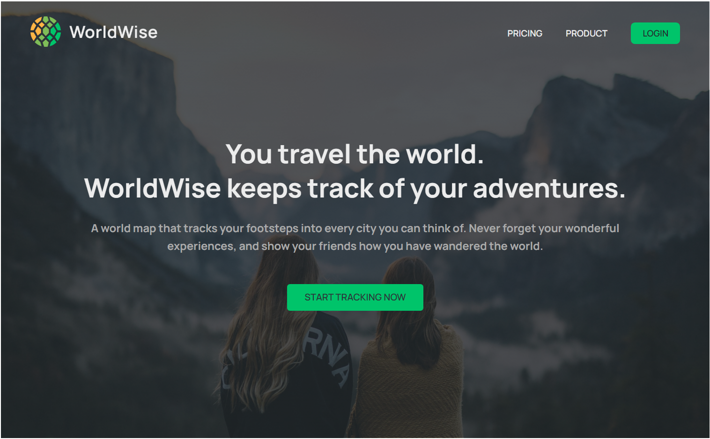

<div align="center">

  

  <h2>WorldWise</h2>

  <h3>
    <a href="https://worldwise-track.netlify.app/">
      <strong>Demo Website</strong>
    </a>
  </h3>

  <div align="center">
    <a href="https://worldwise-track.netlify.app/">View Demo</a>
    •
    <a href="https://github.com/Sujitroy98/the-wild-oasis/issues">Report Bug</a>
  </div>

  <hr>

</div>

<!-- Badges -->
<div align="center">


<a href='https://www.facebook.com/bkp.wale/' target="_blank"></a>
<a href='https://www.linkedin.com/in/sujit-roy-399014229/' target="_blank"></a>

</div>

<!-- Brief -->
<p align="center">
WorldWise is a React application that allows users to explore cities from around the world. It provides information about various cities, including their locations on a map, details about each city, and the ability to create and delete cities.
</p>

<!-- Screenshot -->
<a align="center" href="https://worldwise-track.netlify.app/">




</a>


## Key Features

- View a list of cities and their locations on a map.
- Click on a city marker to see detailed information about the city.
- Create a new city by providing its details.
- Delete a city from the list.

## My process

### Built with

The WorldWise application uses the following open-source libraries:

- [React](https://reactjs.org)
- [React Router](https://reactrouter.com)
- [Leaflet](https://leafletjs.com)
- [React Leaflet](https://react-leaflet.js.org)
- [React DatePicker](https://github.com/Hacker0x01/react-datepicker)
- [JSON Server](https://github.com/typicode/json-server)
- [ESLint](https://eslint.org)


### Installation

The WorldWise application uses a JSON server to provide city data. By default, the server is configured to run on `http://localhost:8000`. If you need to change the server URL, modify the `BASE_URL` constant in the `CitiesContext` component located in `src/contexts/CitiesContext.jsx`.

## Usage

1. Start the JSON server to serve the city data:

```shell
npm run server
```

2. Start the development server:

```shell
npm run dev
```


3. Open your browser and navigate to `http://localhost:3000` to access the WorldWise application.

### Authentication

The WorldWise application includes authentication functionality. You can log in using the following credentials:

- Email: `jack@example.com`
- Password: `qwerty`

## Available Scripts

In the project directory, you can run the following scripts:

- `npm run dev`: Starts the development server.
- `npm run build`: Builds the application for production.
- `npm run preview`: Serves the production build locally for preview.
- `npm run server`: Starts the JSON server to serve city data.


## Contributing

Contributions are welcome! Feel free to open issues and submit pull requests to help improve the WorldWise application.


### Author

<b>👤 Sujit</b>


- LinkedIn - [@sujit-roy98](https://www.linkedin.com/in/sujit-roy-399014229/)
- Github: [@sujit-roy98](https://github.com/Sujitroy98)

Feel free to contact me with any questions or feedback!

### Acknowledgments

This app was developed as part of the [Udemy course](https://www.udemy.com/course/the-ultimate-react-course) "The Ultimate React Course 2023: React, Redux & More" by [Jonas Smechmann](https://twitter.com/jonasschmedtman). Special thanks to Jonas for his exceptional teaching and guidance during the course.
